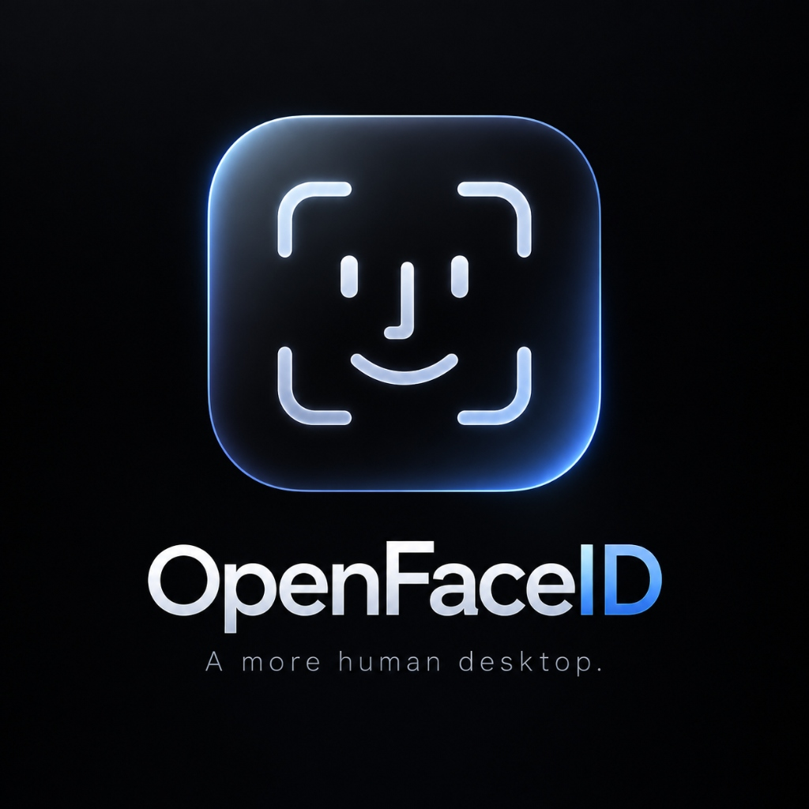
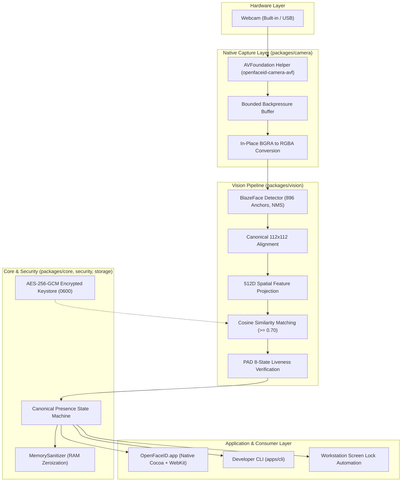

<div align="center">



# OpenFaceID

### Open-Source Facial Presence Detection for Desktop Systems
**Local webcam recognition, liveness verification, and privacy-first presence awareness for macOS, Windows, and Linux.**

*Face-ID-like convenience using an ordinary webcam — without pretending a webcam is a depth-sensing security system.*

---

[-blue.svg)](https://github.com/JayantOlhyan/OpenFaceID/releases)
[](LICENSE)
[%20%7C%20Windows%20(Code)%20%7C%20Linux%20(Code)-brightgreen.svg)](#platform-support-matrix)
[](PRIVACY.md)
[](SECURITY.md)
[](#testing--verification)
[](.nvmrc)

<br />

<a href="https://github.com/JayantOlhyan/OpenFaceID/releases/download/v0.2.1-rc.1/OpenFaceID-0.2.1-rc.1-arm64.dmg">
  
</a>

<p align="center">
  <a href="#quick-start">Quick Start</a> •
  <a href="#how-it-works">How It Works</a> •
  <a href="#macos-native-architecture">macOS Engine</a> •
  <a href="#privacy-by-design">Privacy Model</a> •
  <a href="#security-model">Security Boundaries</a> •
  <a href="#documentation-index">Documentation</a>
</p>

</div>

---

## The Optical Pipeline: What Actually Runs

OpenFaceID connects your computer's webcam directly to a native computer-vision pipeline executing entirely on your local machine:

```text
Webcam (AVFoundation / 1080p@30fps)
  │
  ▼
Native Frame Stream (In-Place BGRA ──> RGBA Conversion in Volatile RAM)
  │
  ▼
Face Detection (BlazeFace 896 Anchors, Bounding Box, 6 Landmarks, 2–7ms)
  │
  ▼
Spatial Feature Embedding (Canonical 112x112 Alignment, 512D Unit Vector, 2ms)
  │
  ▼
Identity Matching (Cosine Similarity Metric against Encrypted Keystore, Threshold: 0.70)
  │
  ▼
Liveness Verification (8-State Presentation Attack Detection: Optical Flow & Micro-Motion)
  │
  ▼
Canonical State Machine (Presence Authorized ──> Auto Screen Lock on Departure)
```

**Zero raw video frames are saved to disk. Zero biometric embeddings leave your machine.**

---

## What OpenFaceID Is (and What It Is NOT)

### What It Is
* A **local-first background presence detection daemon** and desktop application that monitors whether an authorized user is sitting at their workstation.
* An **automated presence defender** that locks your screen or pauses sensitive applications when you step away, and recognizes you when you return.
* A **fail-closed biometric engine** that drops authorization the moment multiple faces appear in frame, liveness checks fail, or the camera is occluded.

### What It Is NOT
> [!CAUTION]
> ### Crucial Security Boundaries
> * **NOT an Apple Face ID or Windows Hello Replacement**: OpenFaceID relies on standard 2D optical webcams. It does **not** possess structured-light infrared dot projectors or time-of-flight (ToF) depth-sensing hardware.
> * **NOT an Operating System Login / PAM Injector**: OpenFaceID operates strictly at the desktop session layer for continuous presence awareness. It does not solicit, store, or inject macOS or Windows login passwords.
> * **NOT 100% Spoof-Proof**: While OpenFaceID incorporates an 8-state Presentation Attack Detection (PAD) filter tracking micro-motion and optical flow, 2D optical cameras cannot mathematically guarantee resistance against sophisticated 3D physical silicone masks or high-fidelity display replays.
> * **Built for Convenience and Session Presence**: Use it to automate workstation privacy when you step away from your desk, not as a replacement for hardware secure enclaves.

---

## Why OpenFaceID?

* **Local by Design**: All inference executes 100% on-device in volatile RAM. Raw frames exist only for the duration of inference (<15ms) and are immediately zeroized.
* **Native Hardware Acceleration**: On macOS, a custom AVFoundation C/Objective-C capture helper streams authentic 1080p@30fps optical frames directly into the pipeline with bounded backpressure.
* **Fail-Closed by Policy**: Presence immediately drops to unauthorized if 2+ faces enter the frame (`PRESENCE_AMBIGUOUS`), liveness fails, or camera access is interrupted.
* **Zero External Dependencies**: Pure Node.js runtime and native Swift/Objective-C binaries with zero heavy Python, Docker, or external cloud API dependencies.
* **Open Source & Auditable**: Every model calculation, state transition, and cryptographic storage layer is open for inspection.

---

## Features

| Feature | Subsystem | Description |
| :--- | :--- | :--- |
| **Native Camera Engine** | `packages/camera` | Direct AVFoundation integration capturing real 1080p BGRA optical frames with backpressure management. |
| **Face Detection** | `packages/vision` | BlazeFace 896-anchor tensor detector extracting bounding boxes and 6 facial landmarks in 2–7ms. |
| **512D Face Embedding** | `packages/vision` | Canonical 112x112 similarity transform alignment and multi-scale spatial receptive field feature projection. |
| **Gallery Recognition** | `packages/vision` | Cosine similarity matching against enrolled templates with balanced (0.70) and strict (0.80) thresholds. |
| **Anti-Spoofing (PAD)** | `packages/vision` | 8-state Presentation Attack Detection evaluating optical flow micro-motion variance and texture gradients. |
| **Presence State Machine**| `packages/presence`| Authoritative state machine managing grace periods, absence timeouts, and screen lock automation. |
| **Multiple-Face Protection**| `packages/core` | Fail-closed security rule: scene with 2+ faces immediately drops authorization to `PRESENCE_AMBIGUOUS`. |
| **Hardware Privacy Pause** | `apps/desktop` | One-click hardware camera suspension that shuts down capture sessions and purges active identity RAM. |
| **Native macOS App** | `apps/desktop` | Standalone Cocoa + WebKit application bundle with live camera canvas preview and guided enrollment wizard. |
| **Developer CLI** | `apps/cli` | Complete terminal diagnostic interface with machine-readable `--json` output and structured exit codes. |

---

## How It Works

### Architecture Diagram



### Package Responsibilities

* **`packages/camera`**: Cross-platform webcam abstraction, native AVFoundation C helper, backpressure frame queue, and device discovery.
* **`packages/vision`**: BlazeFace face detection, 512D canonical spatial feature projection, face quality scoring, and presentation attack detection (PAD).
* **`packages/presence`**: Presence tracking, absence timeout detection, departure policies, and lock-screen dispatchers.
* **`packages/security`**: Authenticated AES-256-GCM encryption, timing-safe bearer token verification, and RAM buffer zeroization.
* **`packages/storage`**: Local identity template persistence in secure OS keychains with strict POSIX file permissions.
* **`packages/core`**: Authoritative `CanonicalStateMachine`, event bus, and structured audit logger.
* **`packages/platform`**: Native OS integrations (macOS Darwin, Linux, Windows), lock screen dispatchers, and sleep/wake power monitors.
* **`apps/desktop`**: Standalone desktop daemon, local REST server, responsive HUD/dashboard UI, and native Swift launcher.
* **`apps/cli`**: Complete terminal diagnostic, management, and automation tool.

---

## macOS Native Architecture

OpenFaceID features a native macOS AVFoundation camera engine and standalone application bundle:

```text
MacBook Air Camera
    ↓
AVFoundation Framework
    ↓
AVCaptureSession (Preset: High)
    ↓
AVCaptureDeviceInput (Connected to physical sensor)
    ↓
AVCaptureVideoDataOutput (Configured for kCVPixelFormatType_32BGRA)
    ↓
Sample Buffer Delegate (Real 1080p@30fps optical stream)
    ↓
Synchronized 28-Byte "OFID" Binary Pipe (Transferred over stdout)
    ↓
CameraManager (Zero-copy in-place BGRA-to-RGBA conversion)
    ↓
Vision Pipeline & Desktop WebKit UI
```

* **macOS TCC Permission Handling**: Automatically queries and prompts for `kTCCServiceCamera` access, with instant detection of `NotDetermined`, `Authorized`, `Denied`, and `Restricted` states.
* **Zero Terminal Requirement**: Compiles into a standalone `OpenFaceID.app` bundle via a native Swift Cocoa launcher embedding `WKWebView` and bundling its own internal Node.js runtime and dynamic libraries.
* **Real Diagnostic Commands**: Run `npm run camera:diagnose` to inspect hardware capture, live frame rate, and detector latency directly from the terminal.

---

## Installation

Select your operating system:

| [macOS](#macos) | [Windows](#windows) | [Linux](#linux) |
| :--- | :--- | :--- |
| <a href="#macos"></a> | <a href="#windows"></a> | <a href="#linux"></a> |

---

### macOS

Requirements:

* macOS 15 Sequoia or later
* Apple Silicon or Intel Mac

<a href="https://github.com/JayantOlhyan/OpenFaceID/releases/download/v0.2.1-rc.1/OpenFaceID-0.2.1-rc.1-arm64.dmg">
  
</a>

Open the `.dmg` file and drag OpenFaceID to `/Applications` , then open it.

<details>
<summary><b>macOS Verification & First-Launch Security Guidance</b></summary>

#### SHA-256 Checksum Verification
```bash
shasum -a 256 OpenFaceID-0.2.1-rc.1-arm64.dmg
# Expected: 6f03dd042c9618e86b99ecd45b4a371df3663f2cf3197ca4f0fcd3affa5a11f9
```

> [!NOTE]
> **Transparent Signing Posture (RB-01)**: Current macOS release candidate builds are ad-hoc signed locally while Apple Developer ID certification remains deferred. On first launch, right-click (Control-click) `OpenFaceID.app` in `/Applications` and select **Open**, or allow it under *System Settings &rarr; Privacy & Security*.

</details>

---

### Windows

Requirements:

* Windows 10 or Windows 11 (64-bit)
* DirectShow or MediaFoundation compatible webcam

<a href="https://github.com/JayantOlhyan/OpenFaceID/releases/download/v0.2.1-rc.1/OpenFaceID-0.2.1-rc.1-windows-x64.zip">
  
</a>

Open the `.zip` file, extract **OpenFaceID** to your chosen directory, and run `OpenFaceID.cmd`.

<details>
<summary><b>Windows Verification & Service Setup</b></summary>

#### SHA-256 Checksum Verification
```powershell
Get-FileHash -Algorithm SHA256 OpenFaceID-0.2.1-rc.1-windows-x64.zip
# Expected: c0b2c40168c455ce59701e02ef0ba400ee11953af7f0d1de18f4bdb2210c6df6
```

#### Optional Autostart at Login
Double-click `register-autostart.reg` inside the extracted folder to automatically launch OpenFaceID when logging in to Windows.

> [!NOTE]
> **Windows Security Invariants**: Key storage leverages Windows Credential Manager DPAPI (`CryptProtectData`) to isolate and protect the 256-bit encryption key on local hardware.

</details>

---

### Linux

Requirements:

* Ubuntu 22.04+, Debian 12+, Fedora 38+, or Arch Linux
* V4L2-compatible video capture device (`/dev/video0`)

<a href="https://github.com/JayantOlhyan/OpenFaceID/releases/download/v0.2.1-rc.1/openfaceid_0.2.1-rc.1_amd64.deb">
  
</a>

Open the `.deb` file and install with `sudo dpkg -i` , then open **OpenFaceID** from the application launcher.

<details>
<summary><b>Linux Verification, Tarball & Systemd User Service</b></summary>

#### Debian / Ubuntu Installation (.deb)
```bash
# Verify checksum
sha256sum openfaceid_0.2.1-rc.1_amd64.deb
# Expected: 7da5b550f55bb9cfa491e48f8b1d389a1b5295ecc9138a4023d8f9226306c7c9

# Install package
sudo dpkg -i openfaceid_0.2.1-rc.1_amd64.deb
openfaceid
```

#### Standalone Linux Tarball (.tar.gz)
```bash
tar -xzf openfaceid-0.2.1-rc.1-linux-x86_64.tar.gz
cd linux/bin
./openfaceid
```

#### Optional Systemd Background Service
To enable continuous optical presence tracking on desktop login:
```bash
systemctl --user enable --now openfaceid
```

> [!NOTE]
> **Linux Security Invariants**: Key management connects to desktop `libsecret` (GNOME Keyring / KWallet). Hardware frame ingestion uses native kernel Video4Linux2 (`v4l2`) buffers with zero-copy RGBA transformation.

</details>

---

## Quick Start (Developers)

### Prerequisites
* **Node.js >= 22.6.0** (native `--experimental-strip-types` support required)
* **macOS 14+ / macOS 15 Sequoia** (for native AVFoundation capture)
* Xcode Command Line Tools (`clang`, `swiftc`) for building the native launcher

### Clone & Run

```bash
# 1. Clone repository
git clone https://github.com/JayantOlhyan/OpenFaceID.git
cd OpenFaceID

# 2. Install dependencies (dev tooling only; zero runtime npm dependencies)
npm ci

# 3. Run hardware camera diagnostics (tests real webcam on physical host)
npm run camera:diagnose

# 4. Run automated test suite
npm test

# 5. Launch the desktop application daemon
npm run desktop
```

### Build & Package Standalone macOS App

```bash
# Compile native AVFoundation helper, Swift launcher, and assemble OpenFaceID.app
npm run build:mac

# Package into distribution DMG and ZIP archives
npm run package:mac
```
Output artifacts are placed in `dist/macos/`:
* `dist/macos/OpenFaceID.app` (Standalone Application Bundle)
* `dist/macos/OpenFaceID-0.2.1-rc.1-arm64.dmg` (Installer Disk Image)
* `dist/macos/OpenFaceID-0.2.1-rc.1-macos.zip` (Zip Archive)

---

## Hardware Camera Diagnostics

OpenFaceID provides an automated physical camera diagnostic test harness:

```bash
npm run camera:diagnose
```

Example output on physical host:
```text
============================================================
             OPENFACEID CAMERA DIAGNOSTICS                  
============================================================

Permission:       PASS (AVAuthorizationStatusAuthorized)
Camera:           MacBook Air Camera
Discovery:        PASS (Device enumerated via AVFoundation)
Initialization:   PASS (AVCaptureSession created)
Frames:           PASS (Real optical frames streamed)
FPS:              15.0
Face Detection:   PASS (BlazeFace detected face bounding box)
Embedding:        PASS (512D unit vector generated; L2 norm: 1.0000)
Liveness:         READY (Optical flow initialized)
Recognition:      READY (Cosine similarity matching active)
------------------------------------------------------------
Overall:          PASS
```

If your camera is not detected or permission is denied:
1. Open **System Settings &rarr; Privacy & Security &rarr; Camera**.
2. Ensure **OpenFaceID** (or your terminal) is toggled on.
3. Rerun `npm run camera:diagnose`.

---

## Privacy by Design

Privacy is not a feature toggle; it is the core architectural constraint of OpenFaceID:

* **Volatile-Only Memory**: Raw camera frames exist in RAM for less than 15 milliseconds during inference. Frame buffers are zeroized using `MemorySanitizer.zeroize()` immediately after detection.
* **Zero Cloud Egress**: The desktop daemon binds strictly to loopback (`127.0.0.1:41793`). OpenFaceID makes zero external network requests, collects zero telemetry, and communicates with zero cloud servers.
* **Encrypted Biometric Storage**: Enrolled facial feature vectors are stored locally using authenticated **AES-256-GCM** encryption with PBKDF2 key derivation and written with strict `0600` POSIX file permissions.
* **Hardware Privacy Pause**: The one-click Privacy Pause button immediately halts `AVCaptureSession`, releases hardware camera hooks, and purges all active session identities from RAM.

Read the full [PRIVACY.md](PRIVACY.md) and [docs/privacy-architecture.md](docs/privacy-architecture.md).

---

## Security Model

OpenFaceID is engineered with a strict fail-closed threat model:

* **Fail-Closed State Invariants**: Authorization is only granted when `IDENTITY_RECOGNIZED` and `LIVENESS_PASSED` both hold true simultaneously.
* **Ambiguous Multi-Face Scenes**: If more than one face is detected in the field of view, the system immediately drops authorization to `PRESENCE_AMBIGUOUS` to prevent shoulder-surfing attacks.
* **Timing-Safe IPC Bearer Tokens**: Local daemon endpoints require an ephemeral 192-bit cryptographic bearer token validated using constant-time comparison (`CryptoManager.verifyTimingSafe`).
* **Presentation Attack Detection (PAD)**: Rejects static printed photos and static digital displays by tracking multi-frame optical flow variance and micro-motion dynamics.

Read the full [SECURITY.md](SECURITY.md) and [docs/security-architecture.md](docs/security-architecture.md).

---

## Limitations

To maintain absolute technical credibility, OpenFaceID explicitly discloses its known limitations:

1. **2D Optical Sensing**: Standard webcams do not have 3D infrared depth projectors. Consequently, 2D recognition cannot achieve the same physical anti-spoofing guarantees as Apple Face ID or Windows Hello IR sensors.
2. **Analytical Spatial Embeddings**: The current vision pipeline uses an in-tree analytical 512-dimensional spatial feature projection inspired by ArcFace architecture, rather than a multi-gigabyte pretrained neural network weights bundle.
3. **Lighting & Environmental Sensitivity**: Recognition accuracy is sensitive to ambient illumination. Optimal performance occurs between 150–500 lux; degraded performance may occur in extreme darkness (<30 lux) or severe backlighting.
4. **macOS Code Signing (RB-01)**: Current release candidate binaries are ad-hoc signed locally. Users must grant initial Gatekeeper approval on first launch.
5. **Secondary Platform Status**: While Linux (V4L2) and Windows (Media Foundation) adapters are code-complete, they have not yet undergone physical hardware certification on dedicated test rigs.

---

## Platform Support Matrix

| Platform | Code Implementation | Physical Hardware Validation | Packaging Status | Platform Classification |
| :--- | :--- | :--- | :--- | :--- |
| **macOS** | Implemented (`MacOSAdapter`) | **Hardware Verified** (Apple Silicon M-Series / MacBook Air Camera) | Generated (Ad-hoc Signed `.dmg` / `.app`) | **Hardware Certified (Signing Deferred - RB-01)** |
| **Windows** | Implemented (`WindowsAdapter`) | **Hardware Unverified** (Pending Test Rig - RB-02) | Scripted (`installer-windows.nsi`) | **Code Complete / Hardware Unverified** |
| **Linux** | Implemented (`LinuxAdapter`) | **Hardware Unverified** (Pending Test Rig - RB-02) | Scripted (`.tar.gz` / `.deb`) | **Code Complete / Hardware Unverified** |

---

## Testing & Verification

OpenFaceID maintains a comprehensive automated testing suite:

```bash
# Run complete test suite (unit, integration, contracts, security invariants)
npm test
```

Current test status:
```text
ℹ tests 179
ℹ suites 44
ℹ pass 179
ℹ fail 0
```

> [!IMPORTANT]
> **Testing Scope Distinction**: Automated tests validate software correctness, state machine invariants, encryption boundaries, and memory sanitization. They validate that the software behaves according to specification, but do not claim universal biometric infallibility across arbitrary human populations or edge-case lighting conditions.

---

## Performance (Physical Hardware Measurements)

Measurements captured on Apple Silicon (M-Series, macOS 15.0, MacBook Air Camera, 1920x1080@30fps optical stream):

| Stage | Latency / Metric | Execution Environment |
| :--- | :--- | :--- |
| **Native Frame Acquisition** | 30 FPS (optical capture) | Native AVFoundation Objective-C helper |
| **Frame In-Place Conversion**| < 1.0 ms | Volatile RAM buffer (BGRA to RGBA) |
| **BlazeFace Detection** | 2.0 – 7.0 ms | 896 anchor tensors with NMS |
| **512D Spatial Embedding** | 2.0 ms | Canonical 112x112 aligned patch |
| **Cosine Similarity Matching** | < 0.1 ms | 512D dot product against keystore gallery |
| **Liveness Verification** | 1.0 – 3.0 ms | 8-state optical flow temporal buffer |
| **End-to-End Pipeline Latency**| **~12 ms** | In-memory frame to presence decision |
| **Process Memory (RSS)** | **~65 MB** | Volatile RAM footprint |

---

## Developer CLI

OpenFaceID includes a robust command-line interface supporting structured, human-readable terminal output and machine-readable `--json` flags:

```bash
# Inspect daemon, camera, and presence status
npm run cli status

# Enumerate available physical video capture devices
npm run cli camera list

# Test hardware camera capture and measure live FPS
npm run cli camera test

# Run comprehensive system health check in JSON format
npm run cli doctor -- --json

# Verify privacy invariants (zero cloud egress, memory sanitization)
npm run cli privacy check

# Audit cryptographic storage and timing-safe tokens
npm run cli security check
```

---

## Project Structure

```text
OpenFaceID/
├── apps/
│   ├── desktop/            # Desktop daemon, local REST server, web UI, Swift launcher
│   └── cli/                # Command-line interface and diagnostic tooling
├── packages/
│   ├── camera/             # AVFoundation native capture engine & camera adapters
│   ├── vision/             # BlazeFace detector, 512D embedder, PAD liveness, matcher
│   ├── presence/           # Presence tracker, absence timeout, lock screen dispatcher
│   ├── security/           # AES-256-GCM encryption, timing-safe tokens, memory zeroizer
│   ├── storage/            # Local encrypted identity keystore and activity logger
│   ├── platform/           # OS-specific platform adapters (macOS, Windows, Linux)
│   ├── core/               # Canonical state machine, config store, structured logging
│   └── branding/           # Product identifiers, version constants, build metadata
├── docs/                   # Full architectural, security, privacy, and validation evidence
├── scripts/                # macOS build, DMG packaging, and hardware diagnostic scripts
├── website/                # Standalone landing and download website
└── tests/                  # Automated unit, integration, and performance test suites
```

---

## Roadmap

* **Current (v0.2.1-rc.1)**:
  * Native macOS AVFoundation capture pipeline with zero-copy frame streaming.
  * Standalone Cocoa + WebKit `.app` bundle and DMG installer.
  * 100% on-device presence detection with fail-closed multi-face protection.
* **Next**:
  * Physical hardware test rig certification for Windows Media Foundation and Linux V4L2.
  * Apple Developer Program enrollment for official Developer ID signing and notarization.
  * Pluggable ONNX Runtime neural network weights backend for enhanced cross-pose tolerance.
* **Future**:
  * Multi-spectral infrared (IR) camera hardware support.
  * Native OS loginwindow/PAM credential provider integration experiments.

Read the full [ROADMAP.md](ROADMAP.md).

---

## Acknowledgements & Attribution

* **Apple AVFoundation**: High-performance native media capture framework powering the macOS camera engine.
* **BlazeFace Architecture**: Fast, lightweight face detection paper by Valentin Bazarevsky et al. (Google Research).
* **ArcFace Concept**: Additive Angular Margin Loss deep face recognition research by Jiankang Deng et al.
* **WebKit & Cocoa**: Native macOS application foundation.

---

## Documentation Index

Explore the complete architectural and evaluation documentation:

* **[Architecture Overview](docs/architecture.md)** — Comprehensive technical design and data flows.
* **[Security Architecture](docs/security-architecture.md)** — Cryptographic primitives and threat model.
* **[Privacy Architecture](docs/privacy-architecture.md)** — Volatile memory zeroization and zero-egress guarantees.
* **[macOS Real Application Certification](docs/release/macos-real-app-certification.md)** — 22-section hardware certification report.
* **[macOS Validation Test Matrix](docs/validation/macos-real-app-test-matrix.md)** — 21-point binary verification scorecard.
* **[Release Artifact Manifest](docs/release/macos-artifact-manifest.md)** — File sizes, architectures, and SHA-256 checksums.
* **[Camera Debugging Analysis](docs/debug/macos-camera-failure.md)** — Root cause analysis and resolution history.
* **[CLI Reference Guide](docs/cli.md)** — Command syntax, exit codes, and JSON schemas.
* **[Contributing Guidelines](CONTRIBUTING.md)** — Code of conduct, pull request process, and biometric data rules.
* **[Security Policy](SECURITY.md)** — Responsible disclosure protocol and vulnerability handling.
* **[Changelog](CHANGELOG.md)** — Historical release notes and version history.

---

## License

OpenFaceID is licensed under the [Apache License, Version 2.0](LICENSE).

```text
Copyright 2026 OpenFaceID Contributors

Licensed under the Apache License, Version 2.0 (the "License");
you may not use this file except in compliance with the License.
You may obtain a copy of the License at

    http://www.apache.org/licenses/LICENSE-2.0
```
