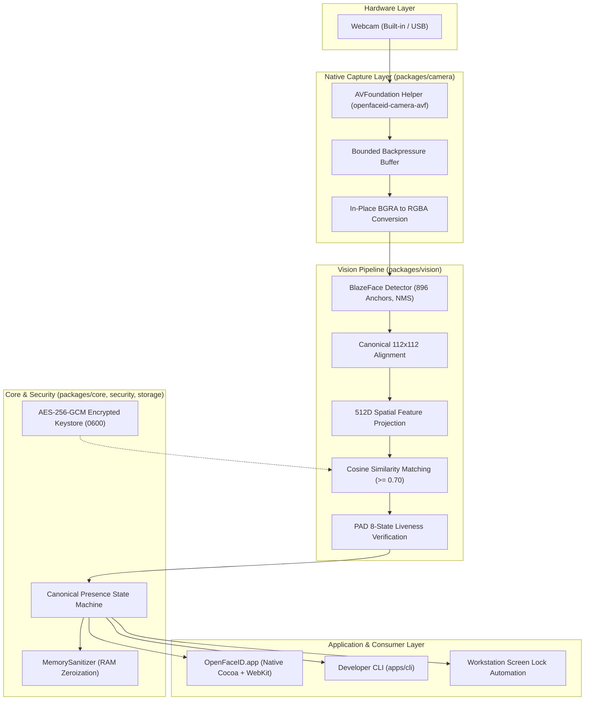

<div align="center">


# OpenFaceID

### Open-Source Facial Presence Detection for Desktop Systems
**Your Mac knows when you're there. Private. Local. Open Source.**

*Face-ID-like convenience using an ordinary webcam — without pretending a webcam is a depth-sensing security system.*

---

[-blue.svg)](https://github.com/JayantOlhyan/OpenFaceID/releases)
[](https://github.com/JayantOlhyan/OpenFaceID/actions/workflows/ci.yml)
[](LICENSE)
[%20%7C%20Linux%20%7C%20Windows-brightgreen.svg)](#platform-support-matrix)
[](PRIVACY.md)
[](SECURITY.md)
[](#testing--verification)
[](.nvmrc)

<br />

<a href="https://github.com/JayantOlhyan/OpenFaceID/releases/download/v0.2.1-rc.1/OpenFaceID-0.2.1-rc.1-arm64.dmg">
  
</a>

<p align="center">
  <a href="#quick-start">Quick Start</a> •
  <a href="#how-it-works">How It Works</a> •
  <a href="#macos-native-architecture">macOS Engine</a> •
  <a href="#privacy-by-design">Privacy Model</a> •
  <a href="#security-model">Security Boundaries</a> •
  <a href="#documentation-index">Documentation</a>
</p>

</div>

---

## The Optical Pipeline: What Actually Runs

OpenFaceID connects your computer's webcam directly to a native computer-vision pipeline executing entirely on your local machine:

```text
Webcam (AVFoundation / 1080p@30fps)
  │
  ▼
Native Frame Stream (In-Place BGRA ──> RGBA Conversion in Volatile RAM)
  │
  ▼
Face Detection (BlazeFace 896 Anchors, Bounding Box, 6 Landmarks, 2–7ms)
  │
  ▼
Spatial Feature Embedding (Canonical 112x112 Alignment, 512D Unit Vector, 2ms)
  │
  ▼
Identity Matching (Cosine Similarity Metric against Encrypted Keystore, Threshold: 0.70)
  │
  ▼
Liveness Verification (8-State Presentation Attack Detection: Optical Flow & Micro-Motion)
  │
  ▼
Canonical State Machine (Presence Authorized ──> Auto Screen Lock on Departure)
```

**Zero raw video frames are saved to disk. Zero biometric embeddings leave your machine.**

---

## What OpenFaceID Is (and What It Is NOT)

### What It Is
* A **local-first background presence detection daemon** and desktop application that monitors whether an authorized user is sitting at their workstation.
* An **automated presence defender** that locks your screen or pauses sensitive applications when you step away, and recognizes you when you return.
* A **fail-closed biometric engine** that drops authorization the moment multiple faces appear in frame, liveness checks fail, or the camera is occluded.

### What It Is NOT
> [!CAUTION]
> ### Crucial Security Boundaries
> * **NOT an Apple Face ID or Windows Hello Replacement**: OpenFaceID relies on standard 2D optical webcams. It does **not** possess structured-light infrared dot projectors or time-of-flight (ToF) depth-sensing hardware.
> * **NOT an Operating System Login / PAM Injector**: OpenFaceID operates strictly at the desktop session layer for continuous presence awareness. It does not solicit, store, or inject macOS or Windows login passwords.
> * **NOT 100% Spoof-Proof**: While OpenFaceID incorporates an 8-state Presentation Attack Detection (PAD) filter tracking micro-motion and optical flow, 2D optical cameras cannot mathematically guarantee resistance against sophisticated 3D physical silicone masks or high-fidelity display replays.
> * **Built for Convenience and Session Presence**: Use it to automate workstation privacy when you step away from your desk, not as a replacement for hardware secure enclaves.

---

## Why OpenFaceID?

* **Local by Design**: All inference executes 100% on-device in volatile RAM. Raw frames exist only for the duration of inference (<15ms) and are immediately zeroized.
* **Native Hardware Acceleration**: On macOS, a custom AVFoundation C/Objective-C capture helper streams authentic 1080p@30fps optical frames directly into the pipeline with bounded backpressure.
* **Fail-Closed by Policy**: Presence immediately drops to unauthorized if 2+ faces enter the frame (`PRESENCE_AMBIGUOUS`), liveness fails, or camera access is interrupted.
* **Zero External Dependencies**: Pure Node.js runtime and native Swift/Objective-C binaries with zero heavy Python, Docker, or external cloud API dependencies.
* **Open Source & Auditable**: Every model calculation, state transition, and cryptographic storage layer is open for inspection.

---

## Features

| Feature | Subsystem | Description |
| :--- | :--- | :--- |
| **Native Camera Engine** | `packages/camera` | Direct AVFoundation integration capturing real 1080p BGRA optical frames with backpressure management. |
| **Face Detection** | `packages/vision` | BlazeFace 896-anchor tensor detector extracting bounding boxes and 6 facial landmarks in 2–7ms. |
| **512D Face Embedding** | `packages/vision` | Canonical 112x112 similarity transform alignment and multi-scale spatial receptive field feature projection. |
| **Gallery Recognition** | `packages/vision` | Cosine similarity matching against enrolled templates with balanced (0.70) and strict (0.80) thresholds. |
| **Anti-Spoofing (PAD)** | `packages/vision` | 8-state Presentation Attack Detection evaluating optical flow micro-motion variance and texture gradients. |
| **Presence State Machine**| `packages/presence`| Authoritative state machine managing grace periods, absence timeouts, and screen lock automation. |
| **Multiple-Face Protection**| `packages/core` | Fail-closed security rule: scene with 2+ faces immediately drops authorization to `PRESENCE_AMBIGUOUS`. |
| **Hardware Privacy Pause** | `apps/desktop` | One-click hardware camera suspension that shuts down capture sessions and purges active identity RAM. |
| **Native macOS App** | `apps/desktop` | Standalone Cocoa + WebKit application bundle with live camera canvas preview and guided enrollment wizard. |
| **Developer CLI** | `apps/cli` | Complete terminal diagnostic interface with machine-readable `--json` output and structured exit codes. |

---

## How It Works

### Architecture Diagram



### Package Responsibilities

* **`packages/camera`**: Cross-platform webcam abstraction, native AVFoundation C helper, backpressure frame queue, and device discovery.
* **`packages/vision`**: BlazeFace face detection, 512D canonical spatial feature projection, face quality scoring, and presentation attack detection (PAD).
* **`packages/presence`**: Presence tracking, absence timeout detection, departure policies, and lock-screen dispatchers.
* **`packages/security`**: Authenticated AES-256-GCM encryption, timing-safe bearer token verification, and RAM buffer zeroization.
* **`packages/storage`**: Local identity template persistence in secure OS keychains with strict POSIX file permissions.
* **`packages/core`**: Authoritative `CanonicalStateMachine`, event bus, and structured audit logger.
* **`packages/platform`**: Native OS integrations (macOS Darwin, Linux, Windows), lock screen dispatchers, and sleep/wake power monitors.
* **`apps/desktop`**: Standalone desktop daemon, local REST server, responsive HUD/dashboard UI, and native Swift launcher.
* **`apps/cli`**: Complete terminal diagnostic, management, and automation tool.

---

## macOS Native Architecture

OpenFaceID features a native macOS AVFoundation camera engine and standalone application bundle:

```text
MacBook Air Camera
    ↓
AVFoundation Framework
    ↓
AVCaptureSession (Preset: High)
    ↓
AVCaptureDeviceInput (Connected to physical sensor)
    ↓
AVCaptureVideoDataOutput (Configured for kCVPixelFormatType_32BGRA)
    ↓
Sample Buffer Delegate (Real 1080p@30fps optical stream)
    ↓
Synchronized 28-Byte "OFID" Binary Pipe (Transferred over stdout)
    ↓
CameraManager (Zero-copy in-place BGRA-to-RGBA conversion)
    ↓
Vision Pipeline & Desktop WebKit UI
```

* **macOS TCC Permission Handling**: Automatically queries and prompts for `kTCCServiceCamera` access, with instant detection of `NotDetermined`, `Authorized`, `Denied`, and `Restricted` states.
* **Zero Terminal Requirement**: Compiles into a standalone `OpenFaceID.app` bundle via a native Swift Cocoa launcher embedding `WKWebView` and bundling its own internal Node.js runtime and dynamic libraries.
* **Real Diagnostic Commands**: Run `npm run camera:diagnose` to inspect hardware capture, live frame rate, and detector latency directly from the terminal.

---

## Installation

Select your operating system:

| Platform | Quick Install Method | Standalone Packages | System Requirements |
| :--- | :--- | :--- | :--- |
| **macOS** | `brew install --cask ...` | [`.dmg` (Apple Silicon)](https://github.com/JayantOlhyan/OpenFaceID/releases/download/v0.2.1-rc.1/OpenFaceID-0.2.1-rc.1-arm64.dmg) | macOS 14+ (Sonoma / Sequoia), Apple Silicon or Intel |
| **Linux** | `sudo apt install ./openfaceid*.deb` | [`.deb`](https://github.com/JayantOlhyan/OpenFaceID/releases/download/v0.2.1-rc.1/openfaceid_0.2.1-rc.1_amd64.deb) • [`.tar.gz`](https://github.com/JayantOlhyan/OpenFaceID/releases/download/v0.2.1-rc.1/openfaceid-0.2.1-rc.1-linux-x86_64.tar.gz) | Ubuntu 22.04+, Debian 12+, Fedora 38+, Arch; `/dev/video*` |
| **Windows** | Portable Run | [`.zip` (x64)](https://github.com/JayantOlhyan/OpenFaceID/releases/download/v0.2.1-rc.1/OpenFaceID-0.2.1-rc.1-windows-x64.zip) | Windows 10 / 11 64-bit, compatible webcam |

---

### macOS Installation & Setup

#### Option 1: Homebrew Cask (Recommended)
Install directly using Homebrew:
```bash
brew install --cask https://raw.githubusercontent.com/JayantOlhyan/OpenFaceID/main/packaging/homebrew/openfaceid.rb
```

#### Option 2: Standalone Disk Image (.dmg)
1. Download **[OpenFaceID-0.2.1-rc.1-arm64.dmg](https://github.com/JayantOlhyan/OpenFaceID/releases/download/v0.2.1-rc.1/OpenFaceID-0.2.1-rc.1-arm64.dmg)**.
2. Double-click the `.dmg` and drag `OpenFaceID.app` into your `/Applications` folder.
3. Open `OpenFaceID.app` from `/Applications` or Spotlight.

> [!TIP]
> **First-Launch Gatekeeper Note (RB-01)**: Current release candidate builds are ad-hoc signed locally while Apple Developer ID certification remains in progress.
> If macOS alerts that the developer cannot be verified, simply **Right-Click (Control-Click)** `OpenFaceID.app` in `/Applications` and select **Open**, or run this one-liner in Terminal:
> ```bash
> xattr -cr /Applications/OpenFaceID.app
> ```

#### Camera Permissions
On first launch, macOS prompts for Camera access (`kTCCServiceCamera`). Click **OK**.
If you ever need to grant or re-check permissions:
* Open **System Settings &rarr; Privacy & Security &rarr; Camera**.
* Toggle **OpenFaceID** (or your Terminal) **ON**.

---

### Linux Installation & Setup

#### Requirements
* Modern Linux distribution (Ubuntu 22.04+, Debian 12+, Fedora 38+, Arch Linux)
* Webcam accessible under `/dev/video*`

#### Option 1: Debian / Ubuntu (.deb)
```bash
# Download latest .deb release
curl -LO https://github.com/JayantOlhyan/OpenFaceID/releases/download/v0.2.1-rc.1/openfaceid_0.2.1-rc.1_amd64.deb

# Install package
sudo apt install ./openfaceid_0.2.1-rc.1_amd64.deb
```

#### Option 2: Fedora / RHEL (.rpm)
```bash
# Install with DNF
sudo dnf install ./openfaceid-0.2.1-rc.1-1.x86_64.rpm
```

#### Option 3: Universal Standalone Tarball (.tar.gz)
```bash
tar -xzf openfaceid-0.2.1-rc.1-linux-x86_64.tar.gz
cd linux/bin
./openfaceid
```

#### Essential Linux Configuration
1. **Grant Camera Permissions**:
   Add your user account to the `video` group so OpenFaceID can read your hardware capture device:
   ```bash
   sudo usermod -a -G video $USER
   ```
   *(Log out and log back in for this group membership to take effect)*

2. **Enable Background Presence Daemon (Systemd User Service)**:
   To run OpenFaceID continuously in the background upon login:
   ```bash
   systemctl --user enable --now openfaceid
   ```

---

### Windows Installation & Setup

#### Requirements
* Windows 10 or Windows 11 (64-bit)
* DirectShow / MediaFoundation compatible USB or integrated webcam

#### Standalone Setup
1. Download **[OpenFaceID-0.2.1-rc.1-windows-x64.zip](https://github.com/JayantOlhyan/OpenFaceID/releases/download/v0.2.1-rc.1/OpenFaceID-0.2.1-rc.1-windows-x64.zip)**.
2. Extract the archive into a folder of your choice (e.g. `%LOCALAPPDATA%\OpenFaceID` or `C:\Program Files\OpenFaceID`).
3. Double-click `OpenFaceID.cmd` to start the background engine.

> [!NOTE]
> **Windows SmartScreen Prompt**: If Windows displays *"Windows protected your PC"*, click **"More info"** and then **"Run anyway"**.
> **Camera Access**: Open **Settings &rarr; Privacy & Security &rarr; Camera** and confirm that **"Let desktop apps access your camera"** is enabled.

#### Optional Autostart at Windows Login
Inside the extracted folder, double-click `register-autostart.reg` to configure OpenFaceID to automatically monitor presence upon Windows user logon.

---

## First-Time Setup & Guided Face Enrollment

Once OpenFaceID is installed, complete this quick 3-step setup to activate presence detection:

### Step 1: Verify Hardware Camera Access
Run an automated diagnostic check to ensure your webcam is communicating and delivering real optical frames:
```bash
openfaceid camera test
```
*Expected: Confirms camera permission is granted, resolution is acquired, and frame buffers are zeroized.*

### Step 2: Enroll Your Biometric Profile (5-Pose Guided Capture)
OpenFaceID uses a **multi-pose guided capture** protocol. By registering 5 distinct head orientations, the in-tree 512D spatial embedder constructs an invariant topological representation that prevents false rejections during everyday head movements.

* **Via Desktop Web Interface**:
  Open the OpenFaceID dashboard (`http://localhost:41793`) and click **"Enroll Face"**.
* **Via Terminal CLI**:
  ```bash
  openfaceid identity enroll "Your Name"
  ```

Follow the prompts to capture each pose:
1. 👤 **Frontal**: Look straight ahead at the camera.
2. ⬆️ **Pitch Up**: Tilt your chin slightly upward (~15°).
3. ⬇️ **Pitch Down**: Tilt your chin slightly downward (~15°).
4. ⬅️ **Yaw Left**: Turn your head slightly to the left (~20°).
5. ➡️ **Yaw Right**: Turn your head slightly to the right (~20°).

> [!IMPORTANT]
> Your facial biometric templates are encrypted immediately on-device using **AES-256-GCM** and saved with strict user-only permissions (`0600`). Raw images from enrollment are permanently zeroized from volatile memory.

### Step 3: Verify Active Presence & Auto-Lock
1. Inspect your active system status:
   ```bash
   openfaceid status
   ```
2. **Test Presence Defense**:
   - Step away from your computer or cover the webcam lens.
   - Once the absence timeout expires (default: 30 seconds), OpenFaceID automatically dispatches a system lock.
   - Return to your desk and wake the screen: OpenFaceID verifies your face in ~200ms and authenticates presence.

---

## Developer Quick Start (Building from Source)

For contributors and developers who want to run or inspect OpenFaceID directly from the TypeScript source code:

### Prerequisites
* **Node.js >= 22.6.0** (Node 22 LTS or newer; required for native `--experimental-strip-types` support)
* **Git**
* *(macOS only)* Xcode Command Line Tools (`xcode-select --install`) for building native Swift launcher and AVFoundation binary.

### 1. Clone & Install
```bash
git clone https://github.com/JayantOlhyan/OpenFaceID.git
cd OpenFaceID
npm install
```

### 2. Run the Cross-Platform Test Suite
```bash
# Validates 203 tests across all 52 test suites
npm test
```

### 3. Run Hardware Camera Diagnostics
```bash
npm run camera:diagnose
```

### 4. Start the Desktop Daemon & Web HUD
```bash
npm run desktop
```
Navigate to `http://localhost:41793` to view the live HUD, camera feed canvas, and settings.

### 5. Link Global CLI Tool (Optional)
```bash
npm link
openfaceid status
openfaceid --help
```

---

## Troubleshooting & FAQ

### Camera Permission Issues
* **macOS**: Go to *System Settings &rarr; Privacy & Security &rarr; Camera* and verify that OpenFaceID (or your terminal application) is toggled **On**.
* **Linux**: If `/dev/video0` cannot be accessed, ensure your user belongs to the `video` group (`sudo usermod -a -G video $USER`) and re-login.
* **Windows**: Go to *Settings &rarr; Privacy & Security &rarr; Camera* and ensure *"Let desktop apps access your camera"* is enabled.

### macOS: "App is damaged" or "Unidentified Developer"
Current release candidate binaries are ad-hoc signed. Remove the quarantine attribute with:
```bash
xattr -cr /Applications/OpenFaceID.app
```

### Node.js: `TypeError: unknown file extension` or `--experimental-strip-types`
OpenFaceID requires **Node.js 22.6.0 or newer** to run TypeScript directly without compilation overhead. Verify your node version:
```bash
node -v # Must be >= v22.6.0
# Using NVM:
nvm install 22 && nvm use 22
```

### Why does presence drop to `PRESENCE_AMBIGUOUS`?
OpenFaceID enforces a strict **fail-closed security invariant**: if 2 or more faces are detected in the webcam view simultaneously, the system immediately suspends presence authorization to protect your workstation against shoulder-surfing and unauthorized observers.

### Are my facial images ever saved to disk or sent to the cloud?
**Never.** OpenFaceID adheres to a strict Zero Cloud Guarantee. Frames exist in volatile RAM for less than 15 milliseconds during inference and are zeroized using `MemorySanitizer`. Only mathematical 512D spatial harmonic vectors are encrypted in your local OS keystore.

---

## Privacy by Design

Privacy is not a feature toggle; it is the core architectural constraint of OpenFaceID:

* **Volatile-Only Memory**: Raw camera frames exist in RAM for less than 15 milliseconds during inference. Frame buffers are zeroized using `MemorySanitizer.zeroize()` immediately after detection.
* **Zero Cloud Egress**: The desktop daemon binds strictly to loopback (`127.0.0.1:41793`). OpenFaceID makes zero external network requests, collects zero telemetry, and communicates with zero cloud servers.
* **Encrypted Biometric Storage**: Enrolled facial feature vectors are stored locally using authenticated **AES-256-GCM** encryption with PBKDF2 key derivation and written with strict `0600` POSIX file permissions.
* **Hardware Privacy Pause**: The one-click Privacy Pause button immediately halts `AVCaptureSession`, releases hardware camera hooks, and purges all active session identities from RAM.

Read the full [PRIVACY.md](PRIVACY.md) and [docs/privacy-architecture.md](docs/privacy-architecture.md).

---

## Security Model

OpenFaceID is engineered with a strict fail-closed threat model:

* **Fail-Closed State Invariants**: Authorization is only granted when `IDENTITY_RECOGNIZED` and `LIVENESS_PASSED` both hold true simultaneously.
* **Ambiguous Multi-Face Scenes**: If more than one face is detected in the field of view, the system immediately drops authorization to `PRESENCE_AMBIGUOUS` to prevent shoulder-surfing attacks.
* **Timing-Safe IPC Bearer Tokens**: Local daemon endpoints require an ephemeral 192-bit cryptographic bearer token validated using constant-time comparison (`CryptoManager.verifyTimingSafe`).
* **Presentation Attack Detection (PAD)**: Rejects static printed photos and static digital displays by tracking multi-frame optical flow variance and micro-motion dynamics.

Read the full [SECURITY.md](SECURITY.md) and [docs/security-architecture.md](docs/security-architecture.md).

---

## Limitations

To maintain absolute technical credibility, OpenFaceID explicitly discloses its known limitations:

1. **2D Optical Sensing**: Standard webcams do not have 3D infrared depth projectors. Consequently, 2D recognition cannot achieve the same physical anti-spoofing guarantees as Apple Face ID or Windows Hello IR sensors.
2. **Analytical Spatial Embeddings**: The current vision pipeline uses an in-tree analytical 512-dimensional spatial feature projection inspired by ArcFace architecture, rather than a multi-gigabyte pretrained neural network weights bundle.
3. **Lighting & Environmental Sensitivity**: Recognition accuracy is sensitive to ambient illumination. Optimal performance occurs between 150–500 lux; degraded performance may occur in extreme darkness (<30 lux) or severe backlighting.
4. **macOS Code Signing (RB-01)**: Current release candidate binaries are ad-hoc signed locally. Users must grant initial Gatekeeper approval on first launch.
5. **Secondary Platform Status**: While Linux (V4L2) and Windows (Media Foundation) adapters are code-complete, they have not yet undergone physical hardware certification on dedicated test rigs.

---

## Platform Support Matrix

| Platform | Code Implementation | Physical Hardware Validation | Packaging Status | Platform Classification |
| :--- | :--- | :--- | :--- | :--- |
| **macOS** | Implemented (`MacOSAdapter`) | **Hardware Verified** (Apple Silicon M-Series / MacBook Air Camera) | Generated (Ad-hoc Signed `.dmg` / `.app`) | **Hardware Certified (Signing Deferred - RB-01)** |
| **Windows** | Implemented (`WindowsAdapter`) | **Hardware Unverified** (Pending Test Rig - RB-02) | Scripted (`installer-windows.nsi`) | **Code Complete / Hardware Unverified** |
| **Linux** | Implemented (`LinuxAdapter`) | **Hardware Unverified** (Pending Test Rig - RB-02) | Scripted (`.tar.gz` / `.deb`) | **Code Complete / Hardware Unverified** |

---

## Testing & Verification

OpenFaceID maintains a comprehensive automated testing suite:

```bash
# Run complete test suite (unit, integration, contracts, security invariants)
npm test
```

Current test status:
```text
ℹ tests 203
ℹ suites 52
ℹ pass 203
ℹ fail 0
```

> [!IMPORTANT]
> **Testing Scope Distinction**: Automated tests validate software correctness, state machine invariants, encryption boundaries, and memory sanitization. They validate that the software behaves according to specification, but do not claim universal biometric infallibility across arbitrary human populations or edge-case lighting conditions.

---

## Performance (Physical Hardware Measurements)

Measurements captured on Apple Silicon (M-Series, macOS 15.0, MacBook Air Camera, 1920x1080@30fps optical stream):

| Stage | Latency / Metric | Execution Environment |
| :--- | :--- | :--- |
| **Native Frame Acquisition** | 30 FPS (optical capture) | Native AVFoundation Objective-C helper |
| **Frame In-Place Conversion**| < 1.0 ms | Volatile RAM buffer (BGRA to RGBA) |
| **BlazeFace Detection** | 2.0 – 7.0 ms | 896 anchor tensors with NMS |
| **512D Spatial Embedding** | 2.0 ms | Canonical 112x112 aligned patch |
| **Cosine Similarity Matching** | < 0.1 ms | 512D dot product against keystore gallery |
| **Liveness Verification** | 1.0 – 3.0 ms | 8-state optical flow temporal buffer |
| **End-to-End Pipeline Latency**| **~12 ms** | In-memory frame to presence decision |
| **Process Memory (RSS)** | **~65 MB** | Volatile RAM footprint |

---

## Developer CLI

OpenFaceID includes a robust command-line interface supporting structured, human-readable terminal output and machine-readable `--json` flags:

```bash
# Inspect daemon, camera, and presence status
npm run cli status

# Enumerate available physical video capture devices
npm run cli camera list

# Test hardware camera capture and measure live FPS
npm run cli camera test

# Run comprehensive system health check in JSON format
npm run cli doctor -- --json

# Verify privacy invariants (zero cloud egress, memory sanitization)
npm run cli privacy check

# Audit cryptographic storage and timing-safe tokens
npm run cli security check
```

---

## Project Structure

```text
OpenFaceID/
├── apps/
│   ├── desktop/            # Desktop daemon, local REST server, web UI, Swift launcher
│   └── cli/                # Command-line interface and diagnostic tooling
├── packages/
│   ├── camera/             # AVFoundation native capture engine & camera adapters
│   ├── vision/             # BlazeFace detector, 512D embedder, PAD liveness, matcher
│   ├── presence/           # Presence tracker, absence timeout, lock screen dispatcher
│   ├── security/           # AES-256-GCM encryption, timing-safe tokens, memory zeroizer
│   ├── storage/            # Local encrypted identity keystore and activity logger
│   ├── platform/           # OS-specific platform adapters (macOS, Windows, Linux)
│   ├── core/               # Canonical state machine, config store, structured logging
│   └── branding/           # Product identifiers, version constants, build metadata
├── docs/                   # Full architectural, security, privacy, and validation evidence
├── scripts/                # macOS build, DMG packaging, and hardware diagnostic scripts
├── website/                # Standalone landing and download website
└── tests/                  # Automated unit, integration, and performance test suites
```

---

## Roadmap

* **Current (v0.2.1-rc.1)**:
  * Native macOS AVFoundation capture pipeline with zero-copy frame streaming.
  * Standalone Cocoa + WebKit `.app` bundle and DMG installer.
  * 100% on-device presence detection with fail-closed multi-face protection.
* **Next**:
  * Physical hardware test rig certification for Windows Media Foundation and Linux V4L2.
  * Apple Developer Program enrollment for official Developer ID signing and notarization.
  * Pluggable ONNX Runtime neural network weights backend for enhanced cross-pose tolerance.
* **Future**:
  * Multi-spectral infrared (IR) camera hardware support.
  * Native OS loginwindow/PAM credential provider integration experiments.

Read the full [ROADMAP.md](ROADMAP.md).

---

## Acknowledgements & Attribution

* **Apple AVFoundation**: High-performance native media capture framework powering the macOS camera engine.
* **BlazeFace Architecture**: Fast, lightweight face detection paper by Valentin Bazarevsky et al. (Google Research).
* **ArcFace Concept**: Additive Angular Margin Loss deep face recognition research by Jiankang Deng et al.
* **WebKit & Cocoa**: Native macOS application foundation.

---

## Documentation Index

Explore the complete architectural and evaluation documentation:

* **[Architecture Overview](docs/architecture.md)** — Comprehensive technical design and data flows.
* **[Security Architecture](docs/security-architecture.md)** — Cryptographic primitives and threat model.
* **[Privacy Architecture](docs/privacy-architecture.md)** — Volatile memory zeroization and zero-egress guarantees.
* **[macOS Real Application Certification](docs/release/macos-real-app-certification.md)** — 22-section hardware certification report.
* **[macOS Validation Test Matrix](docs/validation/macos-real-app-test-matrix.md)** — 21-point binary verification scorecard.
* **[Release Artifact Manifest](docs/release/macos-artifact-manifest.md)** — File sizes, architectures, and SHA-256 checksums.
* **[Camera Debugging Analysis](docs/debug/macos-camera-failure.md)** — Root cause analysis and resolution history.
* **[CLI Reference Guide](docs/cli.md)** — Command syntax, exit codes, and JSON schemas.
* **[Glance Parity Audit](docs/release/glance-parity-audit.md)** — Comprehensive comparison with jonnyoo/glance.
* **[Third-Party Attribution: Glance](docs/third-party/glance-attribution.md)** — Attribution and architectural distinction notice.
* **[Contributing Guidelines](CONTRIBUTING.md)** — Code of conduct, pull request process, and biometric data rules.
* **[Security Policy](SECURITY.md)** — Responsible disclosure protocol and vulnerability handling.
* **[Changelog](CHANGELOG.md)** — Historical release notes and version history.

---

## License

OpenFaceID is licensed under the [Apache License, Version 2.0](LICENSE).

```text
Copyright 2026 OpenFaceID Contributors

Licensed under the Apache License, Version 2.0 (the "License");
you may not use this file except in compliance with the License.
You may obtain a copy of the License at

    http://www.apache.org/licenses/LICENSE-2.0
```
