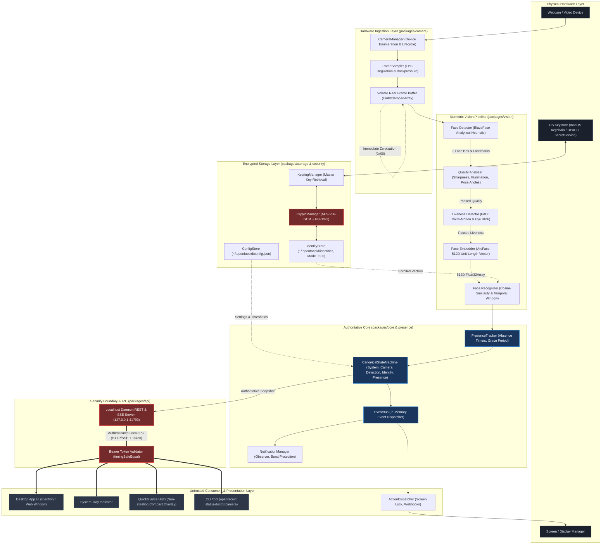

# OpenFaceID Architecture & System Design

## 1. Architectural Philosophy

OpenFaceID (SightLock) is designed around four foundational principles:

1. **Local-First & Volatile-Only Processing**: Biometric pixel buffers exist only in volatile RAM for the duration of inference (<15ms) and are immediately wiped with `MemorySanitizer.zeroizeBuffer`.
2. **Authoritative Core & Untrusted UI**: The user interface (Desktop Window, System Tray, QuickGlance HUD) and CLI are strictly display consumers. They have zero authority over security decisions or presence state. All state transitions occur within the Authoritative Core Daemon.
3. **Cross-Platform Decoupling**: All state machines, computer vision algorithms, and automation policies are 100% platform-agnostic. Operating system quirks are quarantined behind the `PlatformAdapter` interface.
4. **No Plaintext Passwords & No Kernel Hijacking**: OpenFaceID does not solicit, store, or inject operating system passwords, and does not claim to replace OS login (PAM, Windows GINA/Credential Provider, macOS Loginwindow).

---

## 2. End-to-End System Architecture Diagram



---

## 3. Monorepo Package Hierarchy & Dependency Boundaries

To guarantee that business logic never leaks into UI code and security remains centralized, package imports follow a strict one-way hierarchy:

```text
Apps Layer (apps/desktop, apps/cli)
       │
       ▼
IPC & API Layer (packages/api)
       │
       ▼
Authoritative Daemon (apps/desktop/src/daemon.ts)
       │
       ▼
Core Domain Layer (packages/core, packages/presence, packages/automation)
       │
       ▼
Domain Packages (packages/vision, packages/camera, packages/storage)
       │
       ▼
Platform & Security Foundation (packages/security, packages/platform, packages/branding)
```

### 3.1 Strict Dependency Invariants (Enforced by CI & Tests)

* **Rule 1 (`packages/` cannot import `apps/`)**: Domain packages must never reference desktop UI components, Electron shells, or CLI entrypoints.
* **Rule 2 (`packages/core` is downstream-isolated)**: `packages/core` provides fundamental types, state machines, and logging. It never imports `vision`, `camera`, `storage`, or `api`.
* **Rule 3 (`packages/security` is UI-free)**: Cryptographic routines have zero UI or DOM dependencies.
* **Rule 4 (Zero runtime npm dependencies)**: Production builds execute on Node.js standard libraries using native `--experimental-strip-types`.

---

## 4. Authoritative State Machine vs Untrusted UI

The authoritative state machine (`CanonicalStateMachine`) enforces an explicit precedence hierarchy:

```text
Camera State (DISCONNECTED / UNAVAILABLE / INITIALIZING / READY)
      ↓
Detection State (NO_FACE / FACE_DETECTED / MULTIPLE_FACES)
      ↓
Quality State (POOR_LIGHTING / SEVERE_ANGLE / ACCEPTABLE)
      ↓
Liveness State (REQUIRED / RUNNING / PASSED / FAILED)
      ↓
Identity State (UNKNOWN / RECOGNIZED)
      ↓
Presence State (UNAUTHORIZED / USER_PRESENT / GRACE_PERIOD / EXPIRED)
```

### 4.1 Fail-Closed Security Rules

1. **Multiple Faces Rule**: If more than 1 face is detected in the video frame, `CanonicalStateMachine` instantly drops presence to `PRESENCE_UNAUTHORIZED` with reason `Multiple faces detected in frame`. Authorization cannot occur in the presence of secondary individuals.
2. **Liveness Failure Rule**: If micro-motion variance drops below the anti-spoof threshold, liveness transitions to `LIVENESS_FAILED` and presence remains `PRESENCE_UNAUTHORIZED`.
3. **Camera Disconnect Rule**: If the video stream is severed, all presence sessions immediately invalidate; state drops to `CAMERA_DISCONNECTED` and authorization is revoked within 0 ms.
4. **Privacy Pause Rule**: When the user triggers Privacy Pause, camera capture stops completely, active identity memory is wiped, and presence is forced to `PRESENCE_UNAUTHORIZED`.

---

## 5. Security Boundary & IPC

Local applications interact with the OpenFaceID daemon via a loopback-only REST and Server-Sent Events (SSE) server (`127.0.0.1:41793`).

* **Loopback Binding**: The HTTP server binds exclusively to `127.0.0.1` or `::1`. It strictly rejects external network bindings.
* **Bearer Token Authentication**: A cryptographically random 256-bit token is generated on daemon startup and written to `~/.openfaceid/openfaceid.token` with mode `0600`. All mutating or privileged requests must supply `Authorization: Bearer <token>`.
* **Timing-Safe Comparison**: Token comparisons use `crypto.timingSafeEqual` to prevent side-channel timing attacks.
* **Loopback-Only Webhooks**: The `ActionDispatcher` rejects any automation webhook pointing to non-loopback IP addresses or remote hostnames.

---

## 6. Current Platform Hardware Validation Status

| Platform | Code Implementation | Physical Hardware Validation | Packaging Status | Platform Status |
| :--- | :--- | :--- | :--- | :--- |
| **macOS** | Implemented (`MacOSAdapter`) | **VERIFIED** on MacBook Air (M1, Apple Silicon) | DMG / App Bundle (`package-macos.sh`) | Verified with warnings (unsigned) |
| **Windows** | Implemented (`WindowsAdapter`) | **HARDWARE UNVERIFIED** (CI builds pass, camera unverified) | NSIS Installer (`installer-windows.nsi`) | Hardware unverified |
| **Linux** | Implemented (`LinuxAdapter`) | **HARDWARE UNVERIFIED** (CI builds pass, camera unverified) | AppImage / Debian (`package-deb.sh`) | Hardware unverified |
