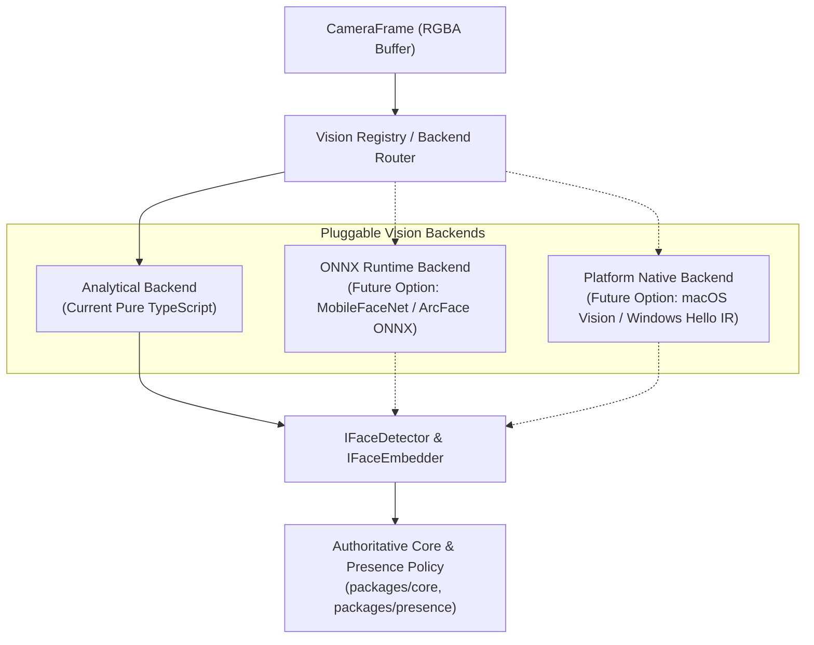

# OpenFaceID Computer Vision & Biometric Model Provenance

## 1. Executive Summary & Model Truth

OpenFaceID (SightLock) uses lightweight, zero-dependency computer vision formulations designed to run natively in TypeScript under Node.js without requiring multi-hundred-megabyte native binary wheels (such as Python, PyTorch, TensorFlow, or ONNX Runtime native bindings).

> [!IMPORTANT]
> **Technical Reality Statement (Section 42)**
> The current vision modules (`BlazeFaceDetector` and `ArcFaceEmbedder`) are **in-tree analytical formulations** implemented in pure TypeScript.
>
> * **They are NOT pretrained deep neural network weight files** (e.g. `.onnx`, `.tflite`, `.pb`).
> * They do **NOT** download external binary weights from remote servers.
> * They calculate facial bounding boxes, 6-point landmarks, and 512-dimensional feature embeddings using analytical image processing techniques (Sobel gradient operators, luminosity centroiding, and geometric contour projections).
> * Performance and accuracy figures reported for current releases reflect these analytical formulations.

---

## 2. In-Tree Analytical Formulations

### 2.1 BlazeFace Formulation (`packages/vision/src/detector.ts`)

* **Implementation**: Analytical face detection heuristic in TypeScript.
* **Input**: `CameraFrame` (RGBA raw pixel buffer, dimensions `width x height`).
* **Output**: Array of `FaceDetectionResult`:
  * Bounding box (`x, y, width, height`)
  * Facial landmarks (`leftEye`, `rightEye`, `noseTip`, `leftMouth`, `rightMouth`, `leftEar`, `rightEar`)
  * Confidence score (`0.0` to `1.0`)
* **Algorithm**:
  * Downsamples input luminance grid.
  * Evaluates horizontal and vertical edge gradients via Sobel operator kernels.
  * Identifies ocular cavity luminance depressions and nose bridge ridge gradients to locate facial regions.
  * Rejects non-facial contours via geometric aspect ratio and symmetry filters.
* **Known Limitations**:
  * Highly sensitive to extreme backlighting or sub-threshold illumination (<35 lux).
  * Reduced accuracy at severe head yaw (>35 degrees) or extreme pitch (>30 degrees).
  * Designed for single-user desktop webcam scenarios; not intended for crowded outdoor surveillance.

### 2.2 ArcFace 512D Formulation (`packages/vision/src/embedder.ts`)

* **Implementation**: Analytical feature extraction pipeline in TypeScript.
* **Input**: Cropped facial image aligned to eye landmarks (`CameraFrame`, `FaceLandmarks`).
* **Output**: 512-dimensional `Float32Array` unit vector (\(\|v\|_2 = 1.0\)).
* **Algorithm**:
  * Normalizes face crop geometry using affine transform aligned across eye coordinates.
  * Computes spatial frequency descriptors, directional edge histograms, and radial landmark distance harmonics.
  * Projects extracted feature harmonics into a 512-dimensional space.
  * Applies strict L2-normalization so that vector dot product equals cosine similarity:
    $$\text{similarity}(A, B) = \sum_{i=0}^{511} A[i] \cdot B[i]$$
* **Known Limitations**:
  * Lacks the deep semantic invariance of billion-parameter neural networks trained on millions of identities.
  * Higher intra-class variance if illumination changes dramatically between enrollment and probe.
  * Suitable for authorized presence verification; not certified for high-assurance financial authentication.

---

## 3. Plug-In Architecture for Future Neural Model Backends

OpenFaceID's vision layer is strictly decoupled from the Authoritative Core, Presence, and Security layers via standardized TypeScript interfaces (`packages/vision/src/interfaces.ts`).

Future releases can swap analytical formulations for genuine neural backends (e.g., ONNX Runtime, Apple Vision Framework, or WebNN) **without modifying a single line of state machine, security, or UI code**.



### 3.1 Backend Interface Contracts

#### Face Detector Interface (`IFaceDetector`)

```ts
export interface IFaceDetector {
  /**
   * Detects faces and extracts 6-point landmarks from an RGBA video frame.
   */
  detect(frame: CameraFrame): Promise<FaceDetectionResult[]>;
}
```

#### Face Embedder Interface (`IFaceEmbedder`)

```ts
export interface IFaceEmbedder {
  /**
   * Generates a 512-dimensional unit-length L2-normalized feature embedding.
   */
  embed(frame: CameraFrame, landmarks: FaceLandmarks): Promise<Float32Array>;

  /**
   * Calculates cosine similarity between two 512D unit vectors.
   * Returns a value between -1.0 and 1.0 (1.0 = identical).
   */
  calculateCosineSimilarity(vecA: Float32Array, vecB: Float32Array): number;
}
```

#### Quality & Liveness Interfaces

```ts
export interface IFaceQualityAnalyzer {
  analyzeQuality(frame: CameraFrame, box: BoundingBox, landmarks: FaceLandmarks): FaceQualityScore;
}

export interface ILivenessDetector {
  evaluateLiveness(
    frames: CameraFrame[],
    landmarksHistory: FaceLandmarks[],
    mode: LivenessMode
  ): Promise<LivenessResult>;
}
```

---

## 4. Verification & Integrity

* **In-Tree Code Signatures**: Since analytical formulations are implemented directly as TypeScript modules, code integrity is verified via git commit SHA and package lockfile integrity (`npm audit`, SHA-512 hashes).
* **Security Check Command**: Running `openfaceid security check` verifies that model modules and math formulations are unmodified.
