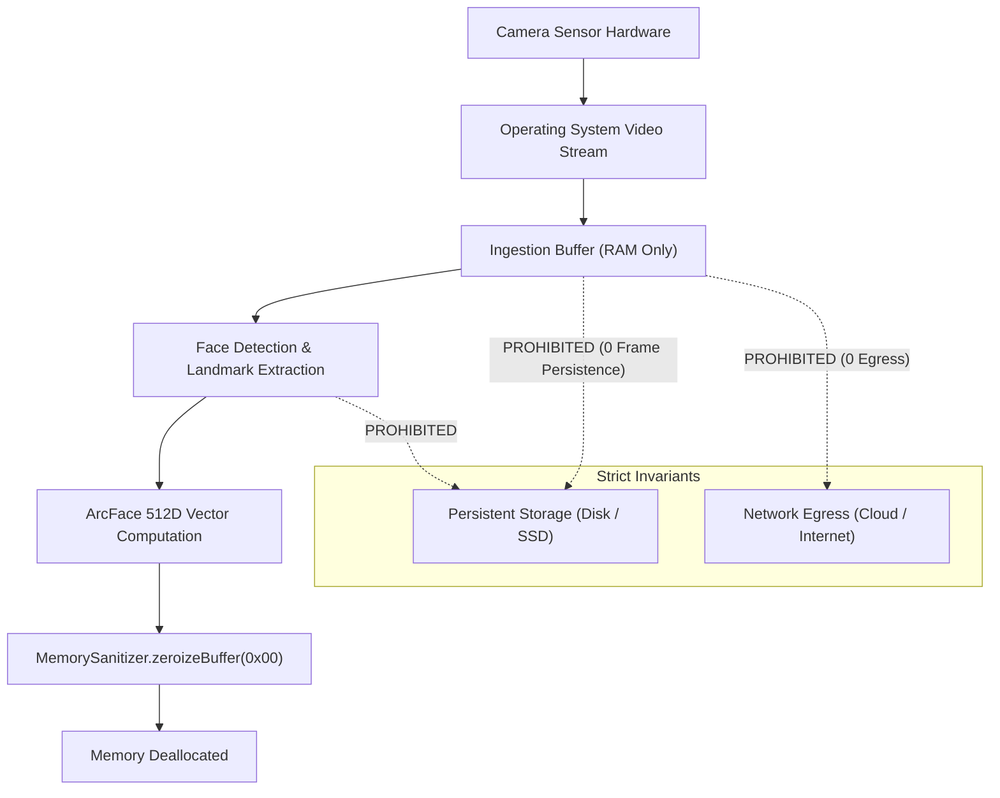
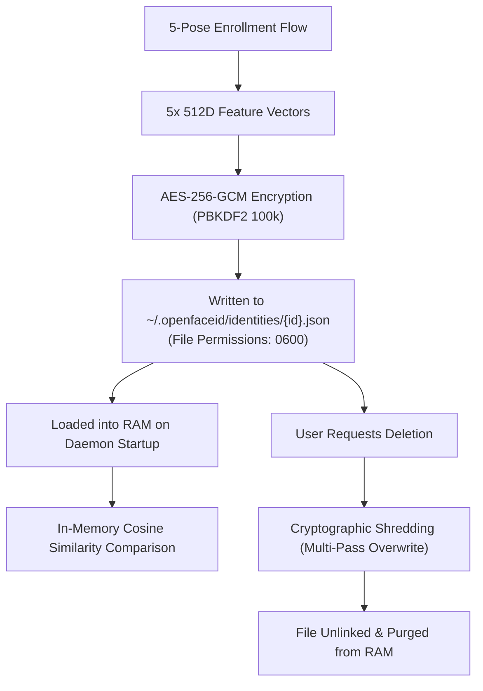

# OpenFaceID Privacy Architecture & Data Lifecycle

## 1. Privacy Philosophy

OpenFaceID adheres to a strict privacy invariant: **Your biometric data never leaves your device, and raw camera frames never touch persistent storage.**

---

## 2. Camera Frame Lifecycle & Zeroization

### 2.1 Volatile Memory Guarantees

* **Lifespan**: Raw frame pixels exist in volatile RAM strictly during inference (typical duration: 3 ms to 12 ms).
* **Zeroization**: Immediately upon extraction of facial landmarks and the 512D embedding, `MemorySanitizer.zeroizeBuffer` is called across all frame and crop buffers, filling them with zeros (`0x00`).
* **Zero Disk Persistence**: Raw camera frames, cropped face images, and intermediate pixel arrays are **NEVER** written to disk, caches, `/tmp`, or swap files.

---

## 3. Biometric Identity Template Lifecycle & Destruction

### 3.1 What is Stored on Disk?

Only the following data is persisted on the local filesystem:

1. **Encrypted Identity Profile (`~/.openfaceid/identities/{id}.json`)**:
   * Encrypted ciphertext containing: identity name, user ID, timestamp, and mathematical feature vectors (512D float arrays).
   * Initialization vector (IV), salt, and GCM authentication tag.
   * **NO photos, NO crops, NO raw face images.**
2. **Configuration (`~/.openfaceid/config.json`)**:
   * Recognition thresholds, timeouts, camera preferences, and UI themes.
3. **Activity Log (`~/.openfaceid/activity.log`)**:
   * High-level state transition timestamps (e.g., `USER_PRESENT`, `USER_LEFT`, `LOCK_ENGAGED`).
   * **Strictly sanitised**: No names, no embeddings, no face coordinates.

---

## 4. Privacy Pause

OpenFaceID provides a global **Privacy Pause** toggle available from the System Tray, QuickGlance HUD, and CLI (`openfaceid desktop pause`).

When Privacy Pause is activated:
1. Video stream capture stops immediately.
2. The camera hardware indicator LED turns off.
3. All internal tracking buffers and active identity states in RAM are zeroized.
4. Authoritative presence drops to `PRESENCE_UNAUTHORIZED`.
5. No camera polling occurs until the user explicitly resumes protection.

---

## 5. Diagnostic Redaction & Content Scanning

When running `openfaceid export-diagnostics` or viewing logs:
* An automated **Sensitive Content Scanner** inspects all fields.
* Any property matching `embedding`, `vector`, `token`, `secret`, `key`, `rawFrame`, or float arrays >= 128 elements is automatically replaced with `[REDACTED_BIOMETRIC_OR_SECRET]`.
* System paths containing usernames are sanitized to prevent personal information leakage.

---

## 6. Retention & User Control

* **Complete Deletion**: Deleting an identity via `openfaceid identity delete <id>` or the desktop UI performs cryptographic multi-pass shredding on disk and evicts the vectors from memory.
* **Log Purging**: Activity history can be cleared at any time via CLI or settings, and automatically purges entries older than the configured retention period (default: 7 days).
