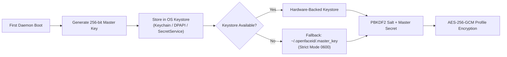

# OpenFaceID Security Architecture & Threat Model

## 1. Executive Summary

OpenFaceID (SightLock) provides local facial presence awareness and continuous workstation presence verification.

> [!IMPORTANT]
> **Explicit Security Boundary**
> OpenFaceID does **NOT** replace:
> * Operating system login (macOS Loginwindow, Windows GINA / Credential Provider, Linux PAM / Display Manager)
> * User passwords, passkeys, or hardware security keys (FIDO2 / YubiKey)
> * Secure Enclave or TPM-backed cryptographic hardware authentication
> * Hardware-certified biometric solutions (Apple Face ID, Windows Hello Infrared)
>
> OpenFaceID operates at the **desktop session layer** to continuously confirm presence and trigger session locking or local automations when the authorized user leaves.

---

## 2. Threat Model

| Threat Scenario | Vector | Mitigation in OpenFaceID |
| :--- | :--- | :--- |
| **Printed Photo / Screen Replay** | Attacker presents 2D photo or tablet video to webcam | Multi-mode Presentation Attack Detection (PAD): passive micro-motion variance analysis, optical flow, eye blink detection, and active challenge-response. |
| **Shoulder Surfing / Co-Presence** | Attacker stands behind or beside the authorized user | Strict **Multiple Faces Invariant**: If face count > 1, state drops immediately to `PRESENCE_UNAUTHORIZED`. |
| **Local Malicious Process** | Unprivileged process attempts to query presence or control daemon | Loopback-only binding (`127.0.0.1:41793`), mandatory 256-bit Bearer token (`~/.openfaceid/openfaceid.token` mode `0600`), and constant-time validation (`crypto.timingSafeEqual`). |
| **Biometric Template Theft** | Malicious actor attempts to read stored facial embeddings | All identity profiles are encrypted at rest using **AES-256-GCM** with PBKDF2 (100,000 iterations). Master key is secured in the OS secure keystore. Files are written with `0600` permissions. |
| **In-Memory Frame Scraping** | Memory dumping attack targeting camera captures | Zero persistent frame storage on disk. Volatile pixel buffers are immediately overwritten (`0x00`) via `MemorySanitizer.zeroizeBuffer` after feature extraction. |
| **Camera Disconnect / Tampering** | Attacker physically unplugs or blinds the camera | Fail-closed state machine: presence session is immediately revoked (0 ms delay); transitions to `CAMERA_DISCONNECTED`. |
| **Arbitrary Code Execution via Scripts** | Insecure automation configuration executes arbitrary shell commands | `ActionDispatcher` uses strictly parameterized execution with `shell: false`. Remote webhook URLs are rejected; only loopback (`127.0.0.1`) URLs are permitted. |

---

## 3. Cryptographic Controls & Key Management

### 3.1 Encryption at Rest (AES-256-GCM)

All enrolled biometric templates (`~/.openfaceid/identities/*.json`) are encrypted using authenticated symmetric encryption:

* **Algorithm**: `aes-256-gcm`
* **Key Derivation**: PBKDF2-HMAC-SHA256 with 100,000 iterations and a cryptographically unique 32-byte salt per profile.
* **Initialization Vector (IV)**: 12-byte cryptographically random IV generated via `crypto.randomBytes(12)` per write.
* **Authentication Tag**: 16-byte GCM authentication tag. Any tampering with ciphertext or salt causes instantaneous decryption failure with `CRYPTO_AUTHENTICATION_FAILURE`.

### 3.2 Key Management Lifecycle

---

## 4. IPC Security Boundary

The authoritative daemon communicates with UI and CLI consumers via a loopback HTTP and Server-Sent Events (SSE) server (`127.0.0.1:41793`).

* **Network Isolation**: Binds strictly to `127.0.0.1`. Attempts to bind to external interfaces (e.g. `0.0.0.0`) are prohibited.
* **Authentication**: Every state-altering or identity-accessing request must provide an `Authorization: Bearer <token>` header.
* **Token Storage**: The token is written to `~/.openfaceid/openfaceid.token` with strict POSIX permissions `0600`.
* **Timing-Safe Evaluation**: Token comparison is performed using `crypto.timingSafeEqual(Buffer.from(provided), Buffer.from(expected))` to mitigate timing side-channel analysis.

---

## 5. Filesystem Permissions & Path Traversal Prevention

* **Configuration Directory**: `~/.openfaceid` is created with permissions `0700` (`rwx------`).
* **Identity Profiles**: Stored in `~/.openfaceid/identities/` with permissions `0600` (`rw-------`).
* **Path Traversal Guards**: Identity identifiers are strictly validated against `/^[a-zA-Z0-9_-]{1,64}$/`. Path separators (`/`, `\`), `..`, and null bytes are rejected with `STORAGE_TRAVERSAL_DENIED`.
* **Cryptographic Shredding**: When an identity is deleted, its file is overwritten with multi-pass random data before unlinking (`fs.unlinkSync`).

---

## 6. Network & Telemetry Policy

* **Zero Cloud Egress**: OpenFaceID makes zero outbound HTTP/HTTPS/WebSocket requests.
* **Zero Telemetry**: No usage metrics, crash reports, hardware fingerprints, or facial embeddings are transmitted externally.
* **Air-Gapped Operation**: OpenFaceID operates 100% offline. Dependencies and analytical models are bundled directly in the repository.

---

## 7. Child Process Security

When OpenFaceID invokes platform utilities (such as `screencapture`, `imagesnap`, `v4l2-ctl`, or `pmset`):
* `shell: false` is permanently enforced on `child_process.spawn` and `execFile`.
* Arguments are passed as discrete array elements; shell interpolation and parameter expansion are strictly avoided.
* Command execution timeouts (max 5,000 ms) are enforced to prevent process hanging.
